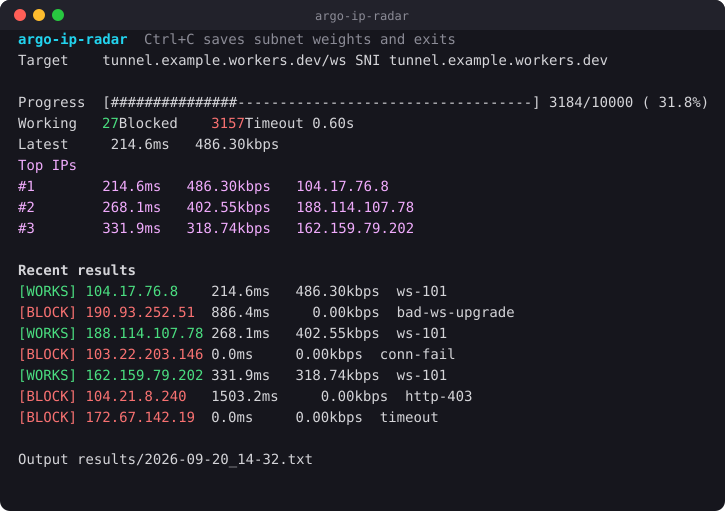

# argo-ip-radar

A dependency-free (Python standard library only) network diagnostic suite for low-bandwidth (500–600 kbps) and filtered environments. **argo-ip-radar** finds Cloudflare entry points that complete a **real WebSocket upgrade** to *your* tunnel, then ranks them by measured throughput and latency.

Unlike a plain ping or TCP sweep, a result only counts as working when the endpoint returns a valid `HTTP/1.1 101 Switching Protocols` response with a correct `Sec-WebSocket-Accept` digest — so an IP that answers TLS but gets blocked at the application layer is correctly reported as blocked.

<p align="center">
  
</p>

---

## Table of Contents

- [Description](#description)
- [Features](#features)
- [Requirements](#requirements)
- [Quick Start](#quick-start)
- [Usage](#usage)
  - [1. Generate Weighted IPs](#1-generate-weighted-ips)
  - [2. Run the Radar](#2-run-the-radar)
  - [3. Sort Results](#3-sort-results)
- [Output Files](#output-files)
- [Result Reason Codes](#result-reason-codes)
- [How it Works](#how-it-works)
- [License](#license)

---

## Description

In regions with aggressive internet filtering and unstable connections, standard network scanners fail in two ways: they use fixed timeouts that misreport jitter as a block, and they test the wrong thing — a TCP or TLS handshake succeeding says nothing about whether a WebSocket tunnel will actually pass traffic through that IP.

**argo-ip-radar** is engineered for these constraints. It performs the full handshake your tunnel performs (TCP → TLS with your SNI → WebSocket `Upgrade` with your Host and path), validates the `101` response cryptographically, and treats each CIDR block as a dynamic entity that "learns" which ranges are worth scanning. Scan state is buffered in RAM and flushed to disk only on completion or interrupt, so scanning does not compete with your limited link.

---

## Features

* **Real WebSocket Upgrade Verification**
  Sends a genuine `Upgrade: websocket` request with browser-like headers and verifies the `101` status, the `Upgrade`/`Connection` headers, and the SHA-1 `Sec-WebSocket-Accept` digest. No false positives from IPs that merely accept TLS.

* **Scans Your Actual Tunnel**
  Paste a `vless://` URL and the scanner extracts `host`, `sni`, `path`, `alpn` and `insecure` automatically, so results reflect your real configuration rather than a generic Cloudflare endpoint.

* **Adaptive Median Timeout**
  Recomputes the connection timeout from the median of recent successful latencies (× 1.5, clamped to your min/max) so that network jitter does not turn good IPs into false block reports.

* **Weighted Subnet Discovery**
  Prioritises scanning in high-performing CIDR blocks using weights stored in `subnets.json`, with per-subnet success/fail counts and rolling average speed.

* **Escalating Fail Penalty**
  Subnets that keep failing are demoted faster than the base rate once enough samples prove the range is consistently filtered.

* **Live Terminal Dashboard**
  In-place progress bar, running working/blocked counts, current adaptive timeout, a top-3 leaderboard and a rolling feed of recent results with reason codes.

* **Resumable Sessions**
  Progress is checkpointed per IP. Re-running continues where you stopped, and automatically starts fresh when `ips.txt` changes.

* **Machine-Readable Summaries**
  Every scan writes a JSON summary with totals, averages, the top results and the exact target/runtime settings used.

* **Memory-Buffered Logging**
  Subnet scores are updated in RAM and written to disk only on completion or `Ctrl+C`, protecting network and disk I/O during the scan.

---

## Requirements

* **Python 3.8+** — standard library only, nothing to install.
* **`subnets.json`** — tracking file for Cloudflare CIDR blocks and their performance weights (included).
* **Network** — an active connection (optimised for 500–600 kbps bottlenecks).

---

## Quick Start

```bash
python ip-gen.py --count 10000
python web-check.py "vless://uuid@example.com:443?type=ws&security=tls&host=tunnel.example.workers.dev&sni=tunnel.example.workers.dev&path=/ws"
python sorter.py --top 20
```

---

## Usage

### 1. Generate Weighted IPs

Creates `ips.txt` by drawing random addresses from `subnets.json`, favouring subnets with better historical performance.

```bash
python ip-gen.py                                   # 10000 IPs into ips.txt
python ip-gen.py --count 8 --output sample_ips.txt # custom size and destination
```

| Flag | Default | Description |
| --- | --- | --- |
| `--count` | `10000` | Number of IPs to generate. |
| `--output` | `ips.txt` | Destination file. |

**Example output**

```console
$ python ip-gen.py --count 8 --output sample_ips.txt
Generated 8 IPs weighted by subnet performance into sample_ips.txt.

$ cat sample_ips.txt
188.114.107.78
104.17.76.8
141.101.91.232
162.159.79.202
103.22.203.146
103.21.246.209
188.114.111.56
190.93.252.51
```

---

### 2. Run the Radar

Tests every IP in `ips.txt` for a complete WebSocket upgrade and measures handshake throughput.

```bash
# Scan against your own tunnel (recommended)
python web-check.py "vless://uuid@example.com:443?type=ws&host=tunnel.example.workers.dev&path=/ws"

# Or specify the target manually
python web-check.py --host tunnel.example.workers.dev --path /ws --insecure

# Tune concurrency and timeouts for a very slow link
python web-check.py --threads 4 --timeout-min 1.0 --timeout-max 4.0
```

The config can also be supplied through the `ARGO_IP_RADAR_CONFIG` environment variable instead of an argument. Explicit flags always override values parsed from the config.

| Flag | Default | Description |
| --- | --- | --- |
| `config` (positional) | – | Optional `vless://` URL; `host`, `sni`, `path`, `alpn` and `insecure` are read from it. |
| `--host` | `cloudflare.com` | HTTP `Host` / WebSocket host. |
| `--sni` | falls back to `--host` | TLS SNI. |
| `--path` | `/cdn-cgi/trace` | WebSocket path, e.g. `/ws`. |
| `--alpn` | – | Comma-separated ALPN list, e.g. `h2,http/1.1`. |
| `--threads` | `10` | Concurrent workers. |
| `--timeout-min` | `0.6` | Lower bound for the adaptive timeout, in seconds. |
| `--timeout-max` | `2.5` | Upper bound for the adaptive timeout, in seconds. |
| `--recent` | `12` | Rows kept in the "Recent results" feed. |
| `--no-color` | off | Disable ANSI colours and screen-control codes (for logs and CI). |
| `--insecure` | off | Disable certificate validation — expected when scanning raw IPs. |

> **Note:** For `type=ws` configs that offer `http/1.1`, the scanner pins ALPN to `http/1.1` only. A classic WebSocket upgrade is an HTTP/1.1 request, and offering `h2` first can make Cloudflare negotiate HTTP/2 — turning a good IP into a false negative.

> **Note:** Press `Ctrl+C` at any time to stop. Updated subnet weights and a scan summary are written to disk before exiting.

**Example output** — the live dashboard, redrawn in place after every result:

```text
argo-ip-radar  Ctrl+C saves subnet weights and exits
Target    tunnel.example.workers.dev/ws SNI tunnel.example.workers.dev

Progress  [###############-----------------------------------] 3184/10000 ( 31.8%)
Working   27   Blocked 3157   Timeout 0.60s
Latest     214.6ms   486.30kbps
Top IPs
#1        214.6ms   486.30kbps   104.17.76.8
#2        268.1ms   402.55kbps   188.114.107.78
#3        331.9ms   318.74kbps   162.159.79.202

Recent results
[WORKS] 104.17.76.8       214.6ms   486.30kbps  ws-101
[BLOCK] 190.93.252.51     886.4ms     0.00kbps  bad-ws-upgrade
[WORKS] 188.114.107.78    268.1ms   402.55kbps  ws-101
[BLOCK] 103.22.203.146      0.0ms     0.00kbps  conn-fail
[WORKS] 162.159.79.202    331.9ms   318.74kbps  ws-101
[BLOCK] 104.21.8.240     1503.2ms     0.00kbps  http-403
[BLOCK] 172.67.142.19       0.0ms     0.00kbps  timeout

Output results/2026-09-20_14-32.txt
```

---

### 3. Sort Results

Merges every raw result file in `results/`, drops anything above the latency limit, and ranks the rest by speed (descending), then latency (ascending).

```bash
python sorter.py                      # everything under 800 ms
python sorter.py --top 20             # best 20 only
python sorter.py --latency-limit 400  # stricter latency cut-off
```

| Flag | Default | Description |
| --- | --- | --- |
| `--input-dir` | `results` | Directory to read raw scan files from. |
| `--latency-limit` | `800.0` | Discard results slower than this, in milliseconds. |
| `--top` | all | Keep only the best N entries. |

**Example output**

```console
$ python sorter.py --top 4
Top IP: 104.17.76.8 at 486.3 kbps
Sorted results written to results/fastest_2026-09-20_14-48.txt

$ cat results/fastest_2026-09-20_14-48.txt
104.17.76.8 | 214.6ms | 486.3kbps
188.114.107.78 | 268.1ms | 402.6kbps
162.159.79.202 | 331.9ms | 318.7kbps
141.101.91.232 | 455.2ms | 241.1kbps
```

Files already prefixed with `fastest_` are skipped on input, so re-running the sorter never feeds its own output back in.

---

## Output Files

| Path | Written by | Contents |
| --- | --- | --- |
| `ips.txt` | `ip-gen.py` | Candidate IPs, one per line. |
| `results/<timestamp>.txt` | `web-check.py` | Working IPs as `IP \| latency \| speed`, appended live. |
| `results/<timestamp>_summary.json` | `web-check.py` | Scan totals, averages, top results, target and runtime settings. |
| `results/fastest_<timestamp>.txt` | `sorter.py` | Filtered and ranked candidates. |
| `subnets.json` | `web-check.py` | Updated per-subnet weight, success/fail counts and average speed. |
| `.session_progress.txt` | `web-check.py` | Checkpoint of already-tested IPs, enabling resume. |
| `.file_id.txt` | `web-check.py` | Fingerprint of `ips.txt`; a change resets progress automatically. |

**Example `results/<timestamp>_summary.json`**

```json
{
  "started_at": "2026-09-20T14:32:05",
  "finished_at": "2026-09-20T14:41:52",
  "interrupted": true,
  "total_ips": 10000,
  "checked_count": 3184,
  "success_count": 27,
  "blocked_count": 3157,
  "avg_latency_ms": 318.4,
  "avg_speed_kbps": 301.55,
  "best": {
    "ip": "104.17.76.8",
    "ttlb": 214.6,
    "speed": 486.3
  },
  "top_results": [
    { "ip": "104.17.76.8", "ttlb": 214.6, "speed": 486.3 },
    { "ip": "188.114.107.78", "ttlb": 268.1, "speed": 402.55 },
    { "ip": "162.159.79.202", "ttlb": 331.9, "speed": 318.74 }
  ],
  "target": {
    "host": "tunnel.example.workers.dev",
    "sni": "tunnel.example.workers.dev",
    "path": "/ws",
    "alpn": ["http/1.1"],
    "insecure": true
  },
  "runtime": {
    "threads": 10,
    "timeout_min": 0.6,
    "timeout_max": 2.5,
    "recent": 12,
    "no_color": false
  },
  "output_file": "results/2026-09-20_14-32.txt",
  "summary_file": "results/2026-09-20_14-32_summary.json"
}
```

**Example `subnets.json` entry after a scan**

```json
{
  "104.16.0.0/13": {
    "weight": 5.963,
    "success_count": 11,
    "fail_count": 240,
    "avg_speed": 412.88
  }
}
```

Plain float weights from older versions are still accepted and upgraded to this format on load.

---

## Result Reason Codes

Every result in the feed carries a reason code explaining the verdict.

| Code | Verdict | Meaning |
| --- | --- | --- |
| `ws-101` | works | Valid `101` upgrade with a matching `Sec-WebSocket-Accept`. |
| `timeout` | blocked | No response within the current adaptive timeout. |
| `conn-fail` | blocked | TCP connection refused or unreachable. |
| `tls-failed` | blocked | TLS handshake failed. |
| `no-http-head` | blocked | Connection succeeded but no complete HTTP response arrived. |
| `http-<code>` | blocked | Answered with a non-101 status, e.g. `http-403` — reachable but filtered at the edge. |
| `bad-ws-upgrade` | blocked | Returned `101` but with wrong headers or an invalid accept digest. |

---

## How it Works

The radar combines a weighted sampler with additive-increase / multiplicative-decrease reinforcement.

**1. Exploration**
`ip-gen.py` draws subnets with probability proportional to their weight, then picks a random address inside each chosen block. High-performing ranges are therefore sampled more densely on every subsequent run.

**2. Evaluation**
Each IP undergoes the same handshake a real client performs:

* TCP connection to port 443 under the current adaptive timeout
* TLS handshake using your SNI and ALPN
* An HTTP/1.1 `Upgrade: websocket` request carrying your Host, path, `Origin` and a browser User-Agent
* Cryptographic validation of the `101` response

Latency is time-to-last-byte of the handshake. Speed is derived from the bytes exchanged during that handshake — it is a comparative throughput signal for ranking candidates, not a bulk-transfer benchmark.

**3. Reinforcement**
Weights are updated in memory and clamped to the range `0.1 – 10.0`:

* **PASS:** `weight + (speed_kbps / 100.0)` — faster endpoints promote their subnet harder.
* **BLOCK:** `weight × penalty`, where `penalty` is `0.9` by default. Once a subnet has at least 5 samples and a fail rate above 70%, the penalty scales with the fail rate down to `0.75` at a 100% fail rate, demoting consistently filtered ranges faster.

Every result also updates that subnet's `success_count`, `fail_count` and running `avg_speed`.

**4. Adaptation**
The connection timeout tracks the median of the last 15 successful latencies (× 1.5, clamped to `--timeout-min`/`--timeout-max`), so the scanner tightens up on a healthy link and loosens on a congested one. Across runs, the updated weights in `subnets.json` steer generation toward productive ranges and away from filtered ones.

---

## License

This project is licensed under the **MIT License**. See [LICENSE](LICENSE) for details.
